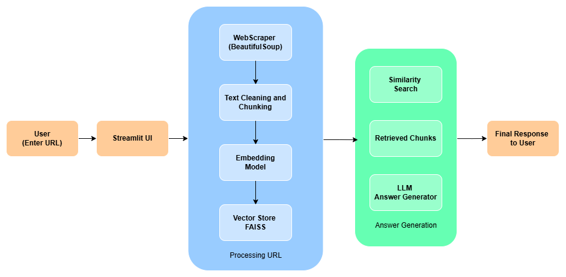

# 🌐 RAG-Powered Website Chatbot

## 📌 Project Overview

This project implements a **Retrieval-Augmented Generation (RAG) chatbot** that can ingest any given website URL, recursively scrape its content, and answer user questions strictly based on the collected information.

The system combines:

- Recursive web scraping
- Intelligent text chunking
- Local semantic embeddings
- FAISS vector search
- Generates grounded responses using OpenAI GPT (via Groq API) 
- Streamlit frontend interface

The goal is to build a **cost-efficient, production-style AI system** that minimizes hallucination and ensures answers are grounded in real website content.

---

## ❓ Problem Statement

Create a chatbot that can ingest any given URL and recursively scrape relevant content from linked pages, 
then use Retrieval-Augmented Generation (RAG) to answer user questions accurately based on the collected content. 
Ensure minimal latency and robust handling of structured and unstructured data.

---

## 🧠 Solution Approach

The system follows a structured RAG pipeline:

Website URL
---->
Recursive Scraper (domain-restricted)
---->
HTML Cleaning & Structured Extraction
---->
Sentence-aware Chunking (with overlap)
---->
Local Embeddings (Sentence Transformers)
---->
FAISS Vector Database
---->
Top-K Semantic Retrieval
---->
OpenAI GPT (via Groq API) to generate Responses
---->
Answer + Source Attribution




### Key Design Decisions

- **Local embeddings** to reduce API cost
- **FAISS for fast similarity search**
- **Top-k retrieval (default = 3)** to control context size
- **Low temperature (0.2)** to improve factual grounding
- **Strict prompt instructions** to reduce hallucination
- **Session-based caching in Streamlit**

This ensures:
- Low API usage
- High factual accuracy
- Scalable design
- Clean separation of components

---

## ⚙️ Features

- Domain-restricted recursive scraping
- Structured extraction (headings, paragraphs, tables)
- Sentence-aware chunking with overlap
- Semantic search using FAISS
- OpenAI GPT powered grounded responses
- Source citation display
- Response latency measurement
- Clean Streamlit UI

---

## 🧩 Tech Stack

| Component             |               Technology |
|-----------------------|--------------------------|
| Frontend + Backend    |                Streamlit |
| LLM                   |      OpenAI via Groq API |
| Vector Store          |                    FAISS |
| Embeddings            |     LLM-based embeddings |
| Web Scraping          | Requests + BeautifulSoup |
| Language              |                   Python |

---

## ⚙️ Installation & Setup

### 1️⃣ Clone Repository

```bash
git clone https://github.com/joelgeema-3130/rag-website-chatbot.git
cd rag-website-chatbot
```

### 2️⃣ Create Virtual Environment

```bash    
python -m venv venv
source venv/bin/activate     # Mac/Linux
venv\Scripts\activate        # Windows
```

### 3️⃣ Install Dependencies

```bash
pip install -r requirements.txt
```

### 4️⃣ Configure Environment Variables

```bash
#Create a .env file:

GROQ_API_KEY=your_groq_api_key_here
```

### ▶️ Running the Application

```bash
streamlit run ui/streamlit_app.py
```

## 🧠 Technical Implementation Details

### 🔹 1. Recursive Web Scraping

Extracts internal links only

Avoids external domain crawling

Removes scripts, styles, navigation clutter

Handles duplicate URLs

Clean HTML-to-text conversion

### 🔹 2. Text Chunking Strategy

Splits content into overlapping chunks

Preserves semantic continuity

Optimized chunk size for embedding quality

Prevents context fragmentation

### 🔹 3. Embedding & Indexing (FAISS)

Converts text chunks into dense vector representations

Stores vectors in FAISS index

Uses euclidean distance for retrieval

Enables sub-second similarity search

### 🔹 4. Retrieval-Augmented Generation

At query time:

User query → embedding

Retrieve Top-K similar chunks

Inject retrieved context into prompt template

Send structured prompt to OpenAI GPT (Groq)

Generate grounded answer

----

### 